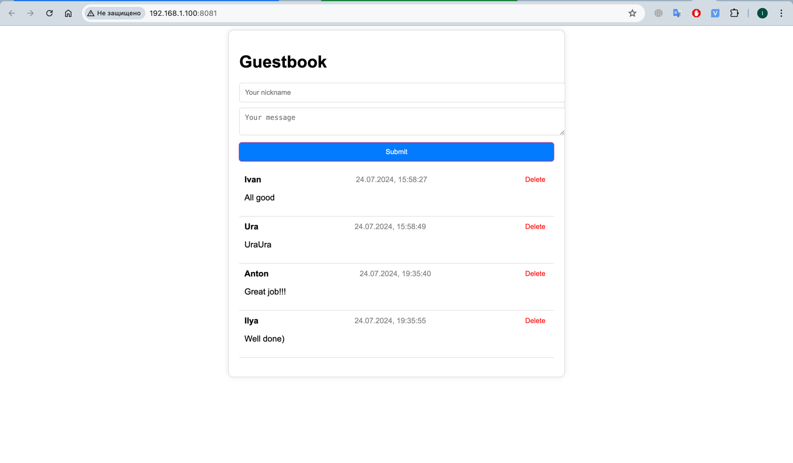

# Project setup
### Set up a database
```
docker compose up
```
### Run and set up the frontend
```
npm install
```
Look at which port your front-end opens and, if necessary, change the line 
```quarkus.http.cors.origins=http://192.168.1.100:{your_port}``` in the ```application.properties``` file

### Compiles and hot-reloads for development
```
npm run serve
```

### Run the backend server
```
qurkus dev
```    


